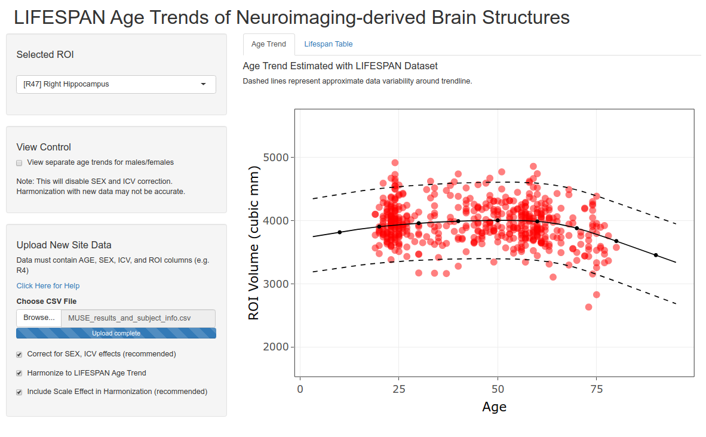

# Interactive visualization of volumetric-age trends for anatomical brain regions.

For further information on methodology, please see [our paper](https://doi.org/10.1016/j.neuroimage.2019.116450).

## How to use the Interactive Visualization

Hosted at ShinyApps.io: [https://rpomponio.shinyapps.io/neuro_lifespan/](https://rpomponio.shinyapps.io/neuro_lifespan/)



Age trends for each ROI from the LIFESPAN dataset are made available via a web-based application. The application allows the user to view any of the age trends from the set 258 ROIs harmonized in the paper. In addition, the user may upload a new study of MUSE ROI volumes to compare them with the presented age trajectories.

To upload a new set of ROI Volumes, your data must be formatted like the following:

```
     ID SEX AGE     ICV    R701     R601
1 00001   F  72 1175485 1029031 591235.8
2 00002   F  44 1321494 1185128 646077.7
3 00003   M  74 1272247 1065918 551219.0
4 00004   F  60 1361529 1200970 660623.5
5 00005   F  55 1357566 1186372 633956.6
6 00006   M  62 1533672 1354049 735330.1
```

Note the following conditions must be met:
1. Columns AGE, SEX, and ICV are present
2. The column labeled SEX contains only "F" for females and only "M" for males
3. ROI Volumes are present in columns with MUSE labels, e.g. for Third Ventricle Volume the correct label is "R4"
4. No missing data present
