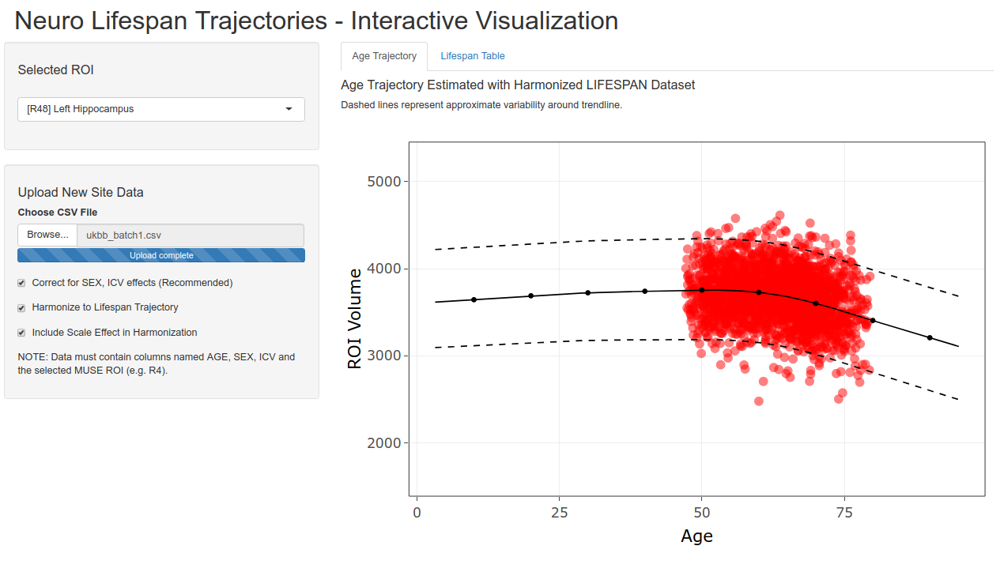

# neuro_lifespan_trajectories

Interactive visualization of volumetric-age trajectories for anatomical brain regions.

## Interactive Visualization

Hosted at ShinyApps.io: [https://rpomponio.shinyapps.io/neuro_lifespan/](https://rpomponio.shinyapps.io/neuro_lifespan/)

Age trajectories for each ROI from the LIFESPAN dataset are made available via a web-based application. The application allows the user to view any of the age trajectories from the set of 145 ROIs harmonized in the study. In addition, the user may upload a new study of ROI volumes to compare them with the presented age trajectories.

To upload a new set of ROI Volumes, the following conditions must be met:
1. Columns AGE, SEX, and ICV are present
2. The column labeled SEX contains only the categories: {"M", "F"}
3. ROI Volumes are present in columns with MUSE labels, e.g. for Third Ventricle Volume the correct label is "R4"
4. No missing data present
